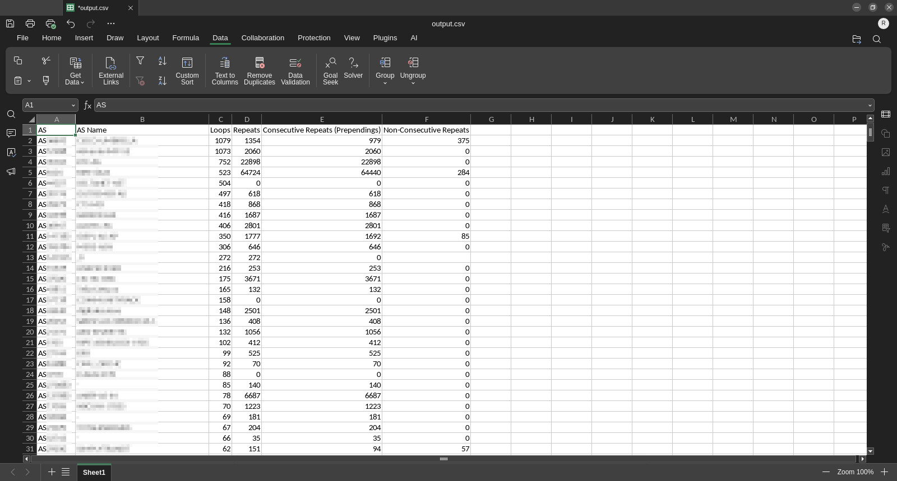
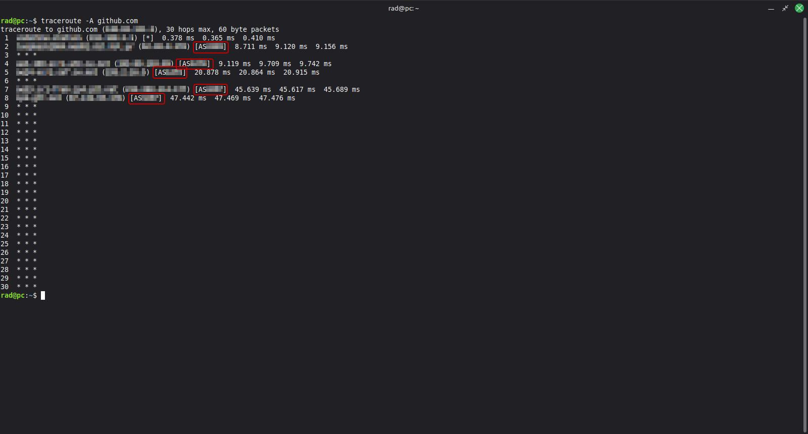

# bgp-inspect



Just like ocean currents, the internet has its own loops and such.

***This tool allows you to find the current loops and prependings on the internet.***

## What is what

### BGP
**BGP (Border Gateway Protocol) is the backbone of the internet**, the routing protocol that allows different networks (Autonomous Systems, or ASes) to exchange information about how to reach destinations across the globe. 

**For example,** your ISP (Internet Service Provider) may be (and propably is) one AS and Github may be (and propably is) another AS. So when you hit Github, you jumb from one AS to the other. BGP is the protocol behind all this. **It's not coinsidence that BGP is called "the glue" of the internet.**

Using `traceroute -A github.com` from a Linux terminal, we can see our journey from our place to github.com, going through many autonomous systems:



Not all machines broadcast details about them, hence we see some "hops" just as asterisks.

### BGP loops

**BGP loops are loops in this protocol, where one AS points, among others, to itself as-well with a single-gap repeat).**

> It's like someone telling you: "Go to my home, then to the kiosk, then to my home, then to my supermaket", where going to the home is a loop. 

> Example: [AS77777, AS44444, AS77777] (single-gap repeat)

### BGP repeats (BGP prepenging)

BGP prepending is a technique where an AS intentionally adds its own AS number multiple times to a path, (**consecutive repeat or non-consecutive repeat with more than one gap**) making the route less preferred. 

Other peers then choose shorter paths. This is usually done to reduce incoming traffic.

> It's like someone telling you "Go to my home, then to the supermarket, then to the supermarket, then to the kiosk", but because it was obvious that you don't have to go "to the supermarket and then again to the supermarket" or because there were two other things between going again to the supermarket, that's not really a loop, at least not the one that causes problems.

> Example: [AS77777, AS77777, AS44444] (consecutive repeat)

> Example: [AS77777, AS44444, AS33333, AS77777] (non-consecutive repeat with more than one gap)

## How to build

```
go build
```

## How to use

> Note: Downloading and analyzing the data may take some time.

This will download the latest BGP data, analyze it, and save the results to the specified file path:
```
./main -o=output.csv
```

To perform WHOIS for each AS above predifined threesholds and get it's name as well:
```
./main -o=output.csv -whois=true
```

To force a re-download of the BGP data:
```
./main -o=output.csv -update-latest-bview=true
```

> For the best experience, is highly suggested to open the CSV on a spreadsheet editor and sort based on: Loops (descending), then Prependings (descending).

## More on BGP
[BGP: Border Gateway Protocol - Computerphile](https://www.youtube.com/watch?v=O6tCoD5c_U0)
